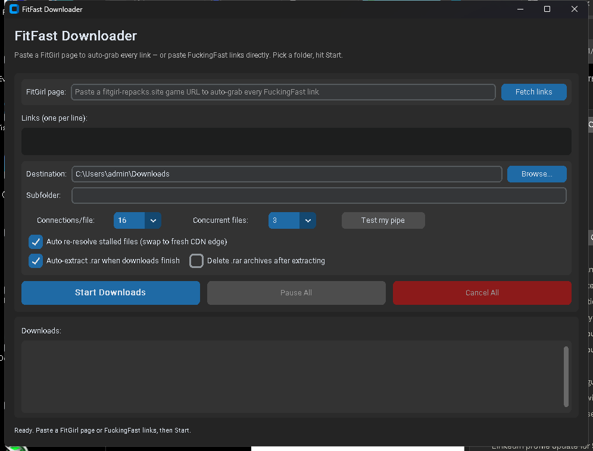
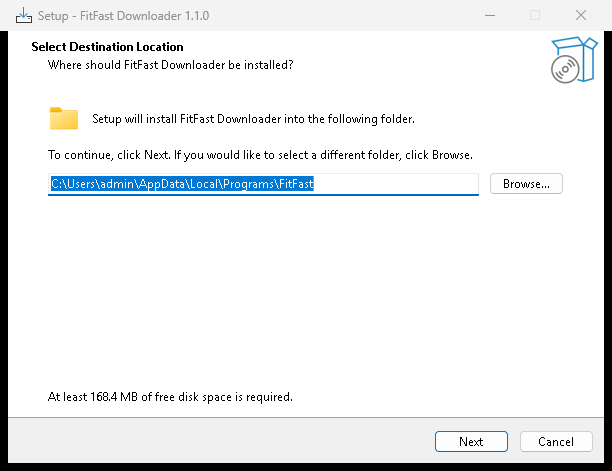
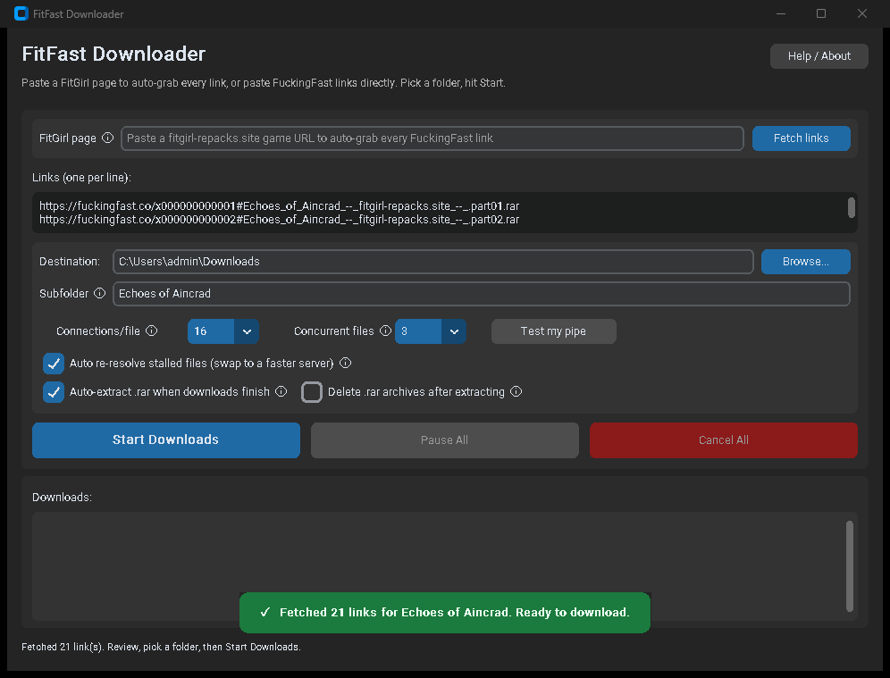
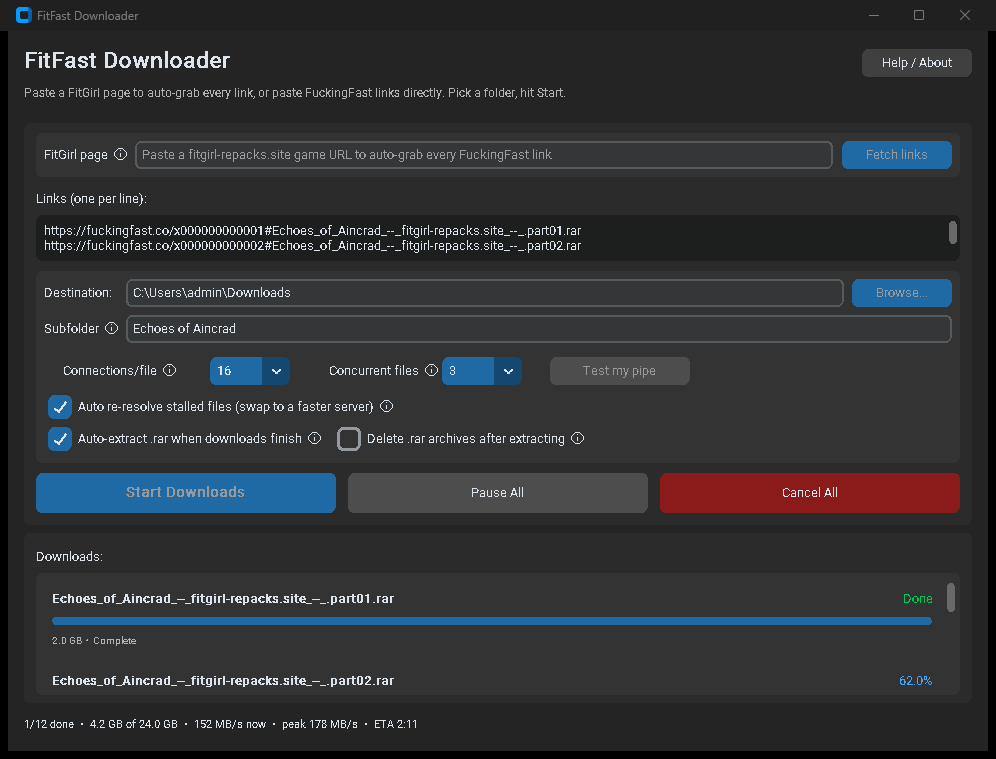
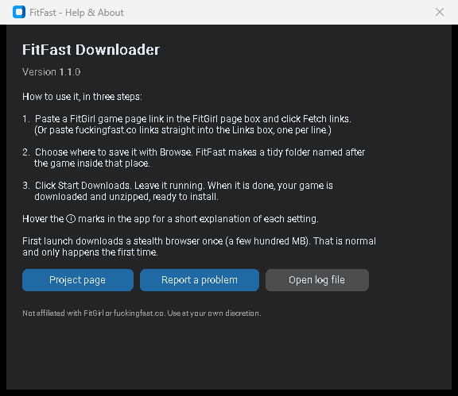

# FitFast Downloader

**The easy way to download FitGirl Repacks from fuckingfast.co.** Paste a game page, click a button, and FitFast grabs every part, downloads them all fast, and unzips them for you. No more clicking eighteen links by hand or getting blocked by Cloudflare.




---

## What is this?

FitGirl repacks come as a big stack of `.rar` files (part 1, part 2, part 3, and so on) on a host called **fuckingfast.co**. That host blocks normal download managers like JDownloader with a Cloudflare wall, and it makes you click every single link by hand.

**FitFast does all of that for you.** You give it a FitGirl game page, it collects every download link, gets past the block, downloads everything at full speed, and unzips the result into one tidy folder. When it finishes, your game is ready to install.

## Is it safe?

- **The code is open.** Anyone can read exactly what it does, right here in this repository.
- **Nothing is hidden and nothing phones home.** It downloads only the links you give it.
- It uses two well known, trusted tools under the hood: **aria2** (a popular fast downloader) and **UnRAR** (the official RAR unzipper), both unchanged.
- It is not a virus. Windows may still show a warning the first time because the app is new and not yet code-signed (that costs money). The steps below show you how to get past that warning safely.

You use it at your own discretion. See the [disclaimer](#disclaimer) at the bottom.

---

## How to install it (about 2 minutes)

**Step 1. Download the installer.**
Go to the [**Releases page**](https://github.com/DEM9N101/FitFast-Downloader/releases/latest) and download the file named **`FitFast-Setup-v1.1.0.exe`** (about 46 MB).

**Step 2. Open it.**
Double-click the file you just downloaded.

Windows might show a blue box that says **"Windows protected your PC."** This is normal for new apps. Click the small **"More info"** link, then click the **"Run anyway"** button that appears. (This happens because the app is not code-signed yet. The code is open here if you want to check it.)

**Step 3. Click through the installer.**
A simple window opens. Click **Next**, then **Install**. It installs just for you, so it does not ask for an administrator password.



That is it. FitFast is now in your Start Menu (and on your desktop if you ticked the box).

> **First time you open it:** FitFast downloads a special browser once, so it can get past the Cloudflare block. This is a few hundred megabytes and takes a few minutes. You only wait for this once. A little window shows the progress. After that, the app opens instantly every time.

---

## How to use it (three steps)

**Step 1. Get the links.**
Open your web browser, find the game you want on fitgirl-repacks.site, and copy its page address. Paste that address into the **FitGirl page** box in FitFast and click **Fetch links**.

FitFast opens the page and fills in every download link for you. You will see a green bar confirming it worked.



*(Already have the direct fuckingfast.co links? You can paste them straight into the Links box instead, one per line.)*

**Step 2. Choose where to save it.**
Click **Browse** and pick a folder (your Downloads folder is fine). FitFast automatically makes a new folder named after the game inside it, so everything stays tidy.

**Step 3. Click Start Downloads.**
Sit back. FitFast downloads all the parts at once, fixes any slow ones by itself, and unzips everything when it is done. The bar at the bottom keeps you posted.



When you see the "Done" message, open your folder and your game is there, unzipped and ready to install.

---

## What each button does

Not sure what something means? In the app, hover your mouse over any **ⓘ** mark for a short plain-English explanation. Here is the quick version:

| Control | What it does |
| --- | --- |
| **FitGirl page** + **Fetch links** | Paste a game page address, click the button, and it copies every download link for you. |
| **Links** box | The list of download links. Filled in automatically, or paste your own. |
| **Destination** + **Browse** | Where your game gets saved. |
| **Subfolder** | The name of the new folder for this game. Filled in automatically; change it if you like. |
| **Connections/file** | A speed setting. Leave it at 16 unless you know you have a very fast connection. |
| **Concurrent files** | How many files download at the same time. Leave it at 3 for most connections. |
| **Test my pipe** | Checks how fast your internet can go right now. |
| **Auto re-resolve stalled files** | If one file gets stuck on a slow server, FitFast swaps it for a faster one automatically. Keep this on. |
| **Auto-extract .rar when downloads finish** | Unzips the game for you when everything is downloaded. Keep this on. |
| **Delete .rar archives after extracting** | Deletes the zip files after a successful unzip, to save space. Optional. |
| **Start / Pause / Cancel** | Control your downloads. You can pause and come back later. |
| **Help / About** | A short guide and links, any time you need them. |

Green and red pop-up bars appear at the bottom to tell you when things succeed or when something needs your attention.

---

## If something goes wrong

Most problems have a simple fix. Find yours below.

**"Windows protected your PC" appears when I open the installer.**
This is expected for a new app. Click **More info**, then **Run anyway**. It is safe; the whole source is public here.

**The first launch is stuck on "Downloading the stealth browser."**
That is normal and only happens once. It is downloading the browser it needs (a few hundred MB). Leave it running and it will finish. If it fails, check your internet connection and open the app again.

**My antivirus blocked it, or a file went missing.**
Some antivirus programs wrongly flag download tools. If FitFast will not start or the download engine will not run, add an exception (an "allow" rule) for the FitFast folder in your antivirus, then reinstall.

**"Couldn't fetch links from that page."**
Make sure the address is a FitGirl **game page** (not the homepage and not an "upcoming repacks" post), and that you are online. Then click Fetch links again.

**A download crawls at a few KB per second.**
That is the game host giving you a slow server, not FitFast. Keep **Auto re-resolve** turned on and it will try to swap to a faster server. You can also lower **Concurrent files**, or try again later when the host is less busy.

**Some files failed, or nothing downloads.**
The download links from fuckingfast.co expire after a while. Just click **Start Downloads** again and FitFast will get fresh links and continue from where it stopped.

**It downloaded but did not unzip.**
Make sure **Auto-extract** is ticked. If you are running from source, make sure `vendor/UnRAR.exe` is present, or install WinRAR and FitFast will use that instead.

### How to report a problem so it can be fixed

If something breaks, FitFast shows a window with the details. Click **Copy details**, then **Report on GitHub**, and paste (Ctrl+V) into the box that opens. That gives enough information to fix it.

You can also open **Help / About** at any time and click **Open log file** to find the log, or **Report a problem** to go straight to the issue page.



---

## Frequently asked questions

**Is it free?** Yes, completely.

**Do I need to install Python or anything else?** No. The installer includes everything. The only extra thing is the one-time browser download on first launch.

**Does it work on Mac or Linux?** Not yet. Windows 10 and 11 only.

**Where do my games end up?** In the folder you chose with Browse, inside a subfolder named after the game.

**Why is the first-time browser download so big?** It is a full stealth browser, and that is what lets FitFast get past the Cloudflare block that stops other tools. It only downloads once.

**Does it collect my data?** No.

---

## For developers: run from source

You need Python 3.11+ and the Camoufox browser.

```bash
py -m venv .venv
.venv\Scripts\python -m pip install -r requirements.txt
.venv\Scripts\python -m camoufox fetch
.venv\Scripts\python -m app.main
```

`aria2c.exe` and `UnRAR.exe` are included in `vendor/`. To build the Windows app and installer yourself, see `FitFast.spec` (PyInstaller) and `installer/FitFast.iss` (Inno Setup).

### How it works, briefly

1. A stealth browser (Camoufox) opens the fuckingfast.co page and passes the Cloudflare check on its own, then reads the real signed download link out of the page's response.
2. That link goes to aria2, which downloads it over 16 connections at once.
3. A monitor watches each file's speed and, if one stalls, fetches a fresh link and resumes.
4. When everything is done, UnRAR unpacks the archive set into your game folder.

---

## Disclaimer

FitFast Downloader is an independent, unofficial tool. It is **not affiliated with, endorsed by, or connected to FitGirl, FitGirl Repacks, fuckingfast.co, or any file host** in any way. Those names are used only to describe what the tool is compatible with.

This program does not host, provide, or distribute any files or content. It is a general download client for the fuckingfast.co file host, and it only downloads links that you choose to give it. What you download, and whether you have the right to do so, is entirely your responsibility. Please respect the laws where you live and the terms of the websites you use.

The software is provided as is, without warranty of any kind. Use it at your own discretion and your own risk. The authors are not responsible for how you use it or for any data loss, legal issue, or damage that results.

## License

MIT for the FitFast code. Bundled tools keep their own licenses: [aria2](https://github.com/aria2/aria2) (GPLv2) and UnRAR (see `vendor/UnRAR-license.txt`, free to redistribute).

---

<sub>Keywords: FitGirl Repacks downloader, fuckingfast downloader, fuckingfast.co downloader, FitGirl repack download manager, download FitGirl repacks fast, fuckingfast batch download, FitGirl multi part rar downloader, bypass Cloudflare download, aria2 game downloader, FitGirl repacks tool, fuckingfast link extractor, FitGirl auto downloader, easy FitGirl downloader.</sub>
